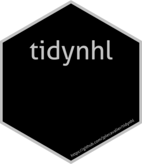

<!-- README.md is generated from README.Rmd. Please edit that file -->

```{r, include = FALSE}
knitr::opts_chunk$set(
  collapse = TRUE,
  comment = "#>"
)
```

# tidynhl 

<!-- badges: start -->
[](https://www.tidyverse.org/lifecycle/#experimental)
[](https://github.com/jplecavalier/tidynhl/actions)
<!-- badges: end -->

## Overview

`tidynhl` is a user-friendly R package which aims at facilitating data extraction through the NHL API in a ready-to-use tidy format.

## Installation

As of now, `tidynhl` is only an experimental package, thus not released on CRAN.

You can install the experimental version of the package directly form github by running the following command :
```{r install, eval=FALSE}
remotes::install_github("jplecavalier/tidynhl")
```
